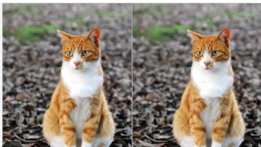

Steganography Project using OpenCV

This project allows you to hide any document or file inside an image by embedding the file's binary data into the least significant bits of the image's pixels. It uses OpenCV to handle image processing and works with most image formats.

Features:

Hide any type of file such as .txt, .pdf, .docx inside an image

Extract the original file from the modified image

Uses OpenCV for pixel-level manipulation

Automatically includes the file's name and size in the header

Saves the final image in PNG format to avoid compression artifacts

How it works:

The file is read in binary form

Each byte is split into 3, 3, and 2 bits

These bits are embedded into the RGB channels of each pixel

The process is reversed to recover the original file from the image

Usage:

Install OpenCV using pip install opencv-python

Run the script using python steganography.py

Choose from the menu:

Enter 1 to embed a file

Enter 2 to extract a file

Enter 3 to exit

File Structure:

steganography.py : Main Python script

op.png : Example image used for testing
